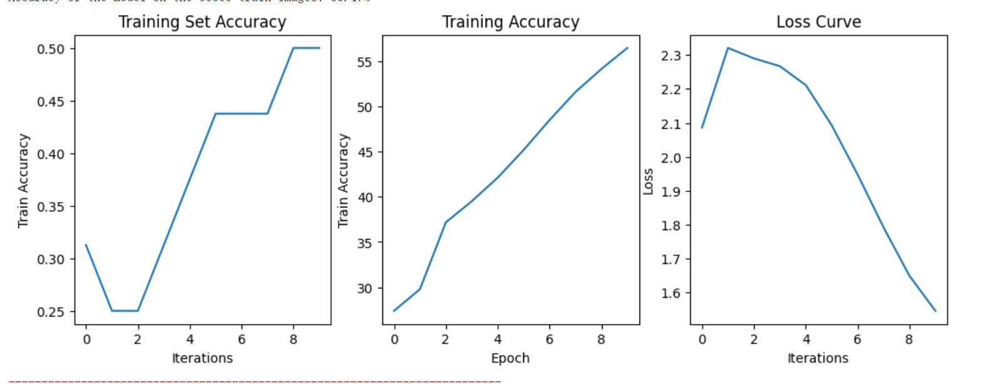

# RCS16_Vision_Train

## 队员：金海洋

### 第一节 opencv实践
效果图

！[扇叶捕捉](../picture/left4.png)

##### 代码部分
    import cv2
    import matplotlib.pyplot as plt
    import numpy as np
    import cv2 as cv
    #加载图像
    img1 = cv.imread('Target.png',cv.IMREAD_GRAYSCALE)          # 索引图像
    img2 = cv.imread('mmm.png',cv.IMREAD_GRAYSCALE) # 训练图像
    ##### 初始化SIFT描述符
    sift = cv.xfeatures2d.SIFT_create()
    ##### 基于SIFT找到关键点和描述符
    kp1, des1 = sift.detectAndCompute(img1,None)
    kp2, des2 = sift.detectAndCompute(img2,None)
    ##### 默认参数初始化BF匹配器
    bf = cv.BFMatcher()
    matches = bf.knnMatch(des1,des2,k=2)
    ##### 应用比例测试
    good = []
    for m,n in matches:
        if m.distance < 0.75*n.distance:
            good.append([m])
    ##### cv.drawMatchesKnn将列表作为匹配项。
    img3 = cv.drawMatchesKnn(img1,kp1,img2,kp2,good,None,flags=cv.DrawMatchesFlags_NOT_DRAW_SINGLE_POINTS)
    plt.imshow(img3),plt.show()
*** 第二节 多次函数回归 ***
### 效果图

！[线性回归](../picture/buhuo.png)

## 代码部分
    import torch
    import torch.nn as nn
    import torch.nn.functional as F

    class Net(nn.Module):

        def __init__(self):
            super(Net, self).__init__()
            # 输入图像是单通道，conv1 kenrnel size=5*5，输出通道 6
            self.conv1 = nn.Conv2d(1, 6, 5)
            # conv2 kernel size=5*5, 输出通道 16
            self.conv2 = nn.Conv2d(6, 16, 5)
            # 全连接层
            self.fc1 = nn.Linear(16*5*5, 120)
            self.fc2 = nn.Linear(120, 84)
            self.fc3 = nn.Linear(84, 10)

        def forward(self, x):
            # max-pooling 采用一个 (2,2) 的滑动窗口
            x = F.max_pool2d(F.relu(self.conv1(x)), (2, 2))
            # 核(kernel)大小是方形的话，可仅定义一个数字，如 (2,2) 用 2 即可
            x = F.max_pool2d(F.relu(self.conv2(x)), 2)
            x = x.view(-1, self.num_flat_features(x))
            x = F.relu(self.fc1(x))
            x = F.relu(self.fc2(x))
            x = self.fc3(x)
            return x

        def num_flat_features(self, x):
            # 除了 batch 维度外的所有维度
            size = x.size()[1:]
            num_features = 1
            for s in size:
                num_features *= s
            return num_features

    net = Net()
    print(net)
    ###### 清空所有参数的梯度缓存，然后计算随机梯度进行反向传播
    net.zero_grad()
    #数据准备
    np.random.seed(42)
    x=2 *np.random.rand(100,1)
    x-=1
    y=1+5*x*x*x+np.random.randn(100,1)*0.1
    plt.scatter(x,y,marker='+',color='blue')
    #数据处理
    import torch
    from torch.utils.data import DataLoader
    from torch.utils.data import TensorDataset

    x=torch.from_numpy(x).float()
    y=torch.from_numpy(y).float()
    dataset=TensorDataset(x,y)

    dataloader=DataLoader(dataset,batch_size=16,shuffle=True)
    print('Len of DataLoader',len(dataloader))
    for index,(data,label) in enumerate(dataloader):
        print(f'index={index},num={len(data):2}')#,data={data},label={label}
    epoch=761

    lr=0.0009999

    w=torch.randn(1,requires_grad=True)
    b=torch.randn(1,requires_grad=True)
    c=torch.randn(1,requires_grad=True)
    d=torch.randn(1,requires_grad=True)
    print(w)
    print(b)
    print(c)
    print(d)
    Loss=[]

    for epoch in range(1,epoch+1):
        sum_loss=0
        for batch_id,(bx,by) in enumerate(dataloader):
            h =w*(bx**3) + b*(bx**2)+bx*c+d
            loss= torch.mean((h-by)**2)
            sum_loss+=loss.item()
            loss.backward()
            w.data-=lr*w.grad.data
            b.data-=lr*b.grad.data
            c.data-=lr*b.grad.data
            d.data-=lr*b.grad.data
            w.grad.zero_()
            b.grad.zero_()
            c.grad.zero_()
            d.grad.zero_()
        Loss.append(sum_loss)

    Loss_x=[i for i in range(1,epoch+1)]
    plt.subplot(121)
    plt.plot(Loss_x,Loss)
    plt.title("JinHaiYang")
    #plt.show()
    w=w.item()
    b=b.item()
    c=c.item()
    d=d.item()
    xx=np.linspace(-1,1,100)
    h =w*(xx**3) + b*(xx**2)+xx*c+d
    plt.subplot(122)
    plt.plot(xx,h)
    plt.scatter(x,y,marker='+',color='red')
    plt.title("JinHaiYang")
    plt.show()

*** 第三节 多层感知器（MLP） ***

### 效果图

！[MLP](../picture/MLP.PNG)

## 代码部分

    import torch
    import torch.nn as nn
    import torch.nn.functional as F

    class Net(nn.Module):

        def __init__(self):
            super(Net, self).__init__()
            # 输入图像是单通道，conv1 kenrnel size=5*5，输出通道 6
            self.conv1 = nn.Conv2d(1, 6, 5)
            # conv2 kernel size=5*5, 输出通道 16
            self.conv2 = nn.Conv2d(6, 16, 5)
            # 全连接层
            self.fc1 = nn.Linear(16*5*5, 120)
            self.fc2 = nn.Linear(120, 84)
            self.fc3 = nn.Linear(84, 10)

        def forward(self, x):
            # max-pooling 采用一个 (2,2) 的滑动窗口
            x = F.max_pool2d(F.relu(self.conv1(x)), (2, 2))
            # 核(kernel)大小是方形的话，可仅定义一个数字，如 (2,2) 用 2 即可
            x = F.max_pool2d(F.relu(self.conv2(x)), 2)
            x = x.view(-1, self.num_flat_features(x))
            x = F.relu(self.fc1(x))
            x = F.relu(self.fc2(x))
            x = self.fc3(x)
            return x

        def num_flat_features(self, x):
            # 除了 batch 维度外的所有维度
            size = x.size()[1:]
            num_features = 1
            for s in size:
                num_features *= s
            return num_features

    net = Net()
    print(net)
    ###### 清空所有参数的梯度缓存，然后计算随机梯度进行反向传播
    net.zero_grad()
    #数据准备
    np.random.seed(42)
    x=2 *np.random.rand(100,1)
    x-=1
    y=1+5*x*x*x+np.random.randn(100,1)*0.1
    plt.scatter(x,y,marker='+',color='blue')
    #数据处理
    import torch
    from torch.utils.data import DataLoader
    from torch.utils.data import TensorDataset

    x=torch.from_numpy(x).float()
    y=torch.from_numpy(y).float()
    dataset=TensorDataset(x,y)

    dataloader=DataLoader(dataset,batch_size=16,shuffle=True)
    print('Len of DataLoader',len(dataloader))
    for index,(data,label) in enumerate(dataloader):
        print(f'index={index},num={len(data):2}')#,data={data},label={label}

    def PlotMLP(net,  input_x, x):
        
        net_eval = net.eval()
        
        net_y = net_eval(input_x)

        net_y_np=net_y.cpu().detach().numpy()

    epoch=760
    lr=0.0009999
    w=torch.randn(1,requires_grad=True)
    b=torch.randn(1,requires_grad=True)
    c=torch.randn(1,requires_grad=True)
    d=torch.randn(1,requires_grad=True)
    print(w)
    print(b)
    print(c)
    print(d)
    Loss=[]
    for epoch in range(1,epoch+1):
        sum_loss=0
        for batch_id,(bx,by) in enumerate(dataloader):
            h =w*(bx**3) + b*(bx**2)+bx*c+d
            loss= torch.mean((h-by)**2)
            # print('Loss',loss)
            sum_loss+=loss.item()
            loss.backward()
            # print('wg:',w.grad.data,'bg:',b.grad.data)
            # print('w:',w.data,'b:',b.data)
            w.data-=lr*w.grad.data
            b.data-=lr*b.grad.data
            c.data-=lr*b.grad.data
            d.data-=lr*b.grad.data
            # print('w:',w.data,'b:',b.data)
            w.grad.zero_()
            b.grad.zero_()
            c.grad.zero_()
            d.grad.zero_()
            # print('wg:',w.grad.data,'bg:',b.grad.data)
            # print(f'epoch:{epoch},batch:{batch_id},loss={loss}')
        # print(f'epoch:{epoch},loss={sum_loss}')
        Loss.append(sum_loss)
    # print(loss.item())
    # print(f'w:{w.item()}')
    # print(f'b:{b.item()}')
    Loss_x=[i for i in range(1,epoch+1)]
    plt.subplot(221)
    plt.plot(Loss_x,Loss)
    plt.title("JinHaiYang")
    #plt.show()
    w=w.item()
    b=b.item()
    c=c.item()
    d=d.item()
    xx=np.linspace(-1,1,100)
    h =w*(xx**3) + b*(xx**2)+xx*c+d

    plt.subplot(222)
    plt.plot(xx,h)
    plt.scatter(x,y,marker='+',color='red')
    plt.title("JinHaiYang")
    #plt.show()
    plt.subplot(223)
    plt.title("evaluation")
    plt.plot(x, torch.sin(x), label="original", linewidth=3)
    plt.plot(x, [y[0] for y in net_y_np], label='MLP',color='red')
    plt.legend()
    plt.tight_layout()
    plt.show()
    PlotMLP(net,input_x,x)

 *** 第四节 深度学习--MLP实现手写字体识别 ***
 ### 效果图
 

 ### 代码部分
    # 导入必要的库
    import torch
    import torch.nn as nn
    import torch.optim as optim
    from torchvision import datasets, transforms
    import matplotlib.pyplot as plt

    # 定义一个多层感知器（MLP）类，继承自 nn.Module
    class MLP(nn.Module):
        def __init__(self, input_size, hidden_size, output_size):
            super(MLP, self).__init__()

            # 构建网络结构
            self.layers = nn.Sequential(
                nn.Linear(input_size, hidden_size),
                nn.ReLU(),
                nn.Linear(hidden_size, output_size)
            )

        def forward(self, x):
            # 定义前向传播
            x = x.view(x.size(0), -1) # Flatten the input tensor
            out = self.layers(x)
            return out

    # 超参数设置
    input_size = 784
    hidden_size = 128
    output_size = 10
    learning_rate = 0.001
    batch_size = 64
    num_epochs = 10

    # 数据预处理
    transform = transforms.Compose([
        transforms.ToTensor(),
        transforms.Normalize((0.1307,), (0.3081,))
    ])

    # 加载MNIST数据集
    train_dataset = datasets.MNIST(root='D:\code\RCS16_Vision_Train\HaiYang_Jin\Training set', train=True, transform=transform, download=True)
    test_dataset = datasets.MNIST(root='D:\code\RCS16_Vision_Train\HaiYang_Jin\Training set', train=False, transform=transform, download=True)

    train_loader = torch.utils.data.DataLoader(train_dataset, batch_size=batch_size, shuffle=True)
    test_loader = torch.utils.data.DataLoader(test_dataset, batch_size=batch_size, shuffle=False)

    # 创建模型、损失函数和优化器对象
    model = MLP(input_size, hidden_size, output_size)
    criterion = nn.CrossEntropyLoss()
    optimizer = optim.Adam(model.parameters(), lr=learning_rate)
    # 定义空列表保存训练集准确率
    train_accuracy = []
    # 存储训练集准确率
    train_accuracy1 = []
    # 开始训练
    losses = []
    for epoch in range(num_epochs):
        for i, (images, labels) in enumerate(train_loader):
        # 前向传播
        outputs = model(images)

        # 计算损失
        loss = criterion(outputs, labels)

        # 反向传播和优化
        optimizer.zero_grad()
        loss.backward()
        optimizer.step()

        # 计算训练集准确率
        _, predicted = torch.max(outputs.data, 1)
        accuracy = (predicted == labels).sum().item() / labels.size(0)
        # train_accuracy.append(accuracy)
        # 记录损失值
        # losses.append(loss.item())
        # 输出损失信息
        if (i+1) % 100 == 0:
            print(f"Epoch [{epoch+1}/{num_epochs}], Step [{i+1}/{len(train_loader)}], Loss: {loss.item():.4f}")
        # 记录损失值
        train_accuracy.append(accuracy)
        losses.append(loss.item())
        # 在每个训练轮次结束后计算训练集准确率
        model.eval()
        correct = 0
        total = 0
        with torch.no_grad():
            for images, labels in train_loader:
                outputs = model(images)
                _, predicted = torch.max(outputs.data, 1)
                total += labels.size(0)
                correct += (predicted == labels).sum().item()
        
        # train_accuracy.append(100 * correct / total)
        train_accuracy1.append(100 * correct / total)
        print(f"Accuracy of the model on the {total} train images: {train_accuracy1[-1]:.2f}%")
    plt.figure(figsize=(12,4))
    # 绘制训练集准确率图像
    plt.subplot(131)
    plt.plot(range(len(train_accuracy)), train_accuracy)
    plt.xlabel('Iterations')
    plt.ylabel('Train Accuracy')
    plt.title('Training Set Accuracy')

        # # 在每个训练轮次结束后计算训练集准确率
        # model.eval()
        # correct = 0
        # total = 0
        # with torch.no_grad():
        #     for images, labels in train_loader:
        #         outputs = model(images)
        #         _, predicted = torch.max(outputs.data, 1)
        #         total += labels.size(0)
        #         correct += (predicted == labels).sum().item()
        
        # # train_accuracy.append(100 * correct / total)
        # train_accuracy1.append(100 * correct / total)
        # print(f"Accuracy of the model on the {total} train images: {train_accuracy1[-1]:.2f}%")
    

    # 绘制训练集准确率图像
    plt.subplot(132)
    plt.plot(range(num_epochs), train_accuracy1)
    plt.xlabel('Epoch')
    plt.ylabel('Train Accuracy')
    plt.title('Training Accuracy')
    # 绘制损失曲线
    plt.subplot(133)
    plt.plot(losses)
    plt.title("Loss Curve")
    plt.xlabel("Iterations")
    plt.ylabel("Loss")
    plt.show()

 *** 第五节 深度学习--CIFAR10分类任务实战 ***

 ### 效果图

 ### 代码部分

    import torch
    import torchvision
    from torch import nn
    from torch.utils.data import DataLoader
    from torch.utils.tensorboard import SummaryWriter
    import matplotlib.pyplot as plt

    # 准备数据集
    train_data = torchvision.datasets.CIFAR10(root='../data', train=True, transform=torchvision.transforms.ToTensor(),
                                            download=True)
    test_data = torchvision.datasets.CIFAR10(root='../data', train=False, transform=torchvision.transforms.ToTensor(),
                                            download=True)

    print("训练集的长度:{}".format(len(train_data)))
    print("测试集的长度:{}".format(len(test_data)))
    num_epochs = 10
    # DataLoader加载数据集
    train_dataloader = DataLoader(train_data, batch_size=64)
    test_dataloader = DataLoader(test_data, batch_size=64)

    # 搭建神经网络
    class Model(nn.Module):
        def __init__(self):
            super(Model, self).__init__()
            self.model = nn.Sequential(
                nn.Conv2d(3, 32, 5, 1, 2),
                nn.MaxPool2d(2),
                nn.Conv2d(32, 32, 5, 1, 2),
                nn.MaxPool2d(2),
                nn.Conv2d(32, 64, 5, 1, 2),
                nn.MaxPool2d(2),
                nn.Flatten(),
                nn.Linear(64 * 4 * 4, 64),
                nn.Linear(64, 10),
            )

        def forward(self, x):
        x = self.model(x)
        return x

    # 创建网络模型
    model = Model().cuda()

    #添加tensorboard可视化数据
    writer = SummaryWriter('../logs_tensorboard')

    # 损失函数
    loss = nn.CrossEntropyLoss().cuda()

    # 优化器
    optimizer  = torch.optim.SGD(model.parameters(),lr=0.01,)
    criterion = nn.CrossEntropyLoss()

    i = 1 # 用于绘制测试集的tensorboard
    # 定义空列表保存训练集准确率
    train_accuracy = []
    # 存储训练集准确率
    train_accuracy1 = []
    # 每轮训练完成跑一下测试数据看看情况
    accurate = 0
    model.eval() # 也可以不写，规范的话就写，用来表明是测试步骤
    # 开始训练
    losses = []
    # 开始循环训练
    for epoch in range(num_epochs):
        num_time = 0 # 记录看看每轮有多少次训练
        print('开始第{}轮训练'.format(epoch+1))
        model.train() # 也可以不写，规范的话是写，用来表明训练步骤
        for data in train_dataloader:  
        # 数据分开 一个是图片数据，一个是真实值
        imgs,targets = data
        imgs = imgs.cuda()
        targets = targets.cuda()
        # 拿到预测值
        output = model(imgs)
        # 计算损失值
        loss_in = loss(output,targets)
        # 优化开始~ ~ 先梯度清零
        optimizer.zero_grad()
        # 反向传播+更新
        loss_in.backward()
        optimizer.step()
        num_time +=1
        # 计算训练集准确率
        _, predicted = torch.max(output.data, 1)
        accuracy = (predicted == targets).sum().item() / targets.size(0)
        
        if num_time % 100 == 0:
            writer.add_scalar('看一下训练集损失值',loss_in.item(),num_time)
        train_accuracy.append(accuracy)
        # 记录损失值
        losses.append(loss_in.detach().cpu().item())
        # 训练步骤...

        # 在每个训练轮次结束后计算训练集准确率
        model.eval()
        correct = 0
        total = 0
        with torch.no_grad():  
        for images, labels in train_dataloader:
            images = images.cuda()
            labels = labels.cuda()
            outputs = model(images)
            _, predicted = torch.max(outputs.data, 1)
            total += labels.size(0)
            correct += (predicted == labels).sum().item()
        
        train_accuracy1.append(100 * correct / total)
        print(f"Accuracy of the model on the {total} train images: {train_accuracy1[-1]:.2f}%")

    sum_loss = 0 # 记录总体损失值
    plt.figure(figsize=(12,4))
    # 绘制训练集准确率图像
    plt.subplot(131)
    plt.plot(range(len(train_accuracy)), train_accuracy)
    plt.xlabel('Iterations')
    plt.ylabel('Train Accuracy')
    plt.title('Training Set Accuracy')
    # 绘制训练集准确率图像
    plt.subplot(132)
    plt.plot(range(num_epochs), train_accuracy1)
    plt.xlabel('Epoch')
    plt.ylabel('Train Accuracy')
    plt.title('Training Accuracy')
    # 绘制损失曲线
    plt.subplot(133)
    plt.plot(losses)
    plt.title("Loss Curve")
    plt.xlabel("Iterations")
    plt.ylabel("Loss")
    plt.show()

    writer.add_scalar('看一下测试集损失',sum_loss,i)
    writer.add_scalar('看一下当前测试集正确率',accurate/len(test_data)*100,i)
    i +=1

    torch.save(model,'../model_pytorch/model_{}.pth'.format(epoch+1))
    print("第{}轮模型训练数据已保存".format(epoch+1))

    writer.close()