# RCS16_Vision_Train
## 队员成果展示
### 第一节 opencv实践
#### 夏星
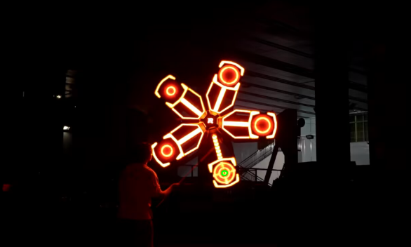

### 第二节 机器学习--多次函数回归

#### 陈靖辉
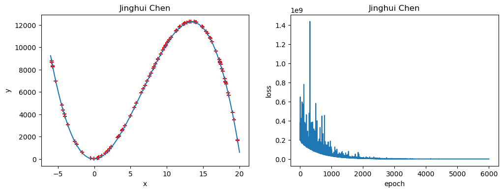

#### 郑凯航
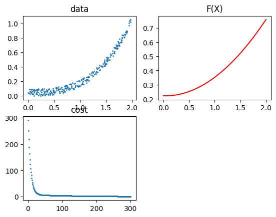

#### 金海洋
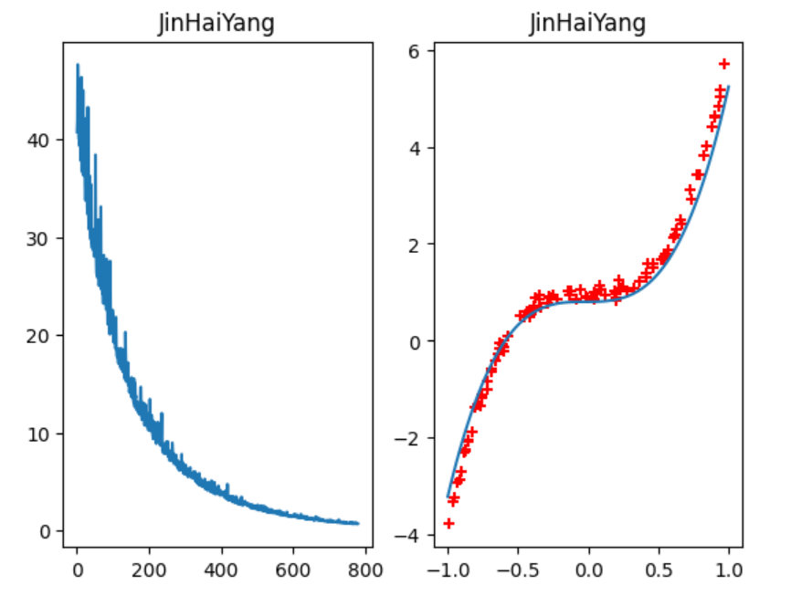

#### 褚皓程
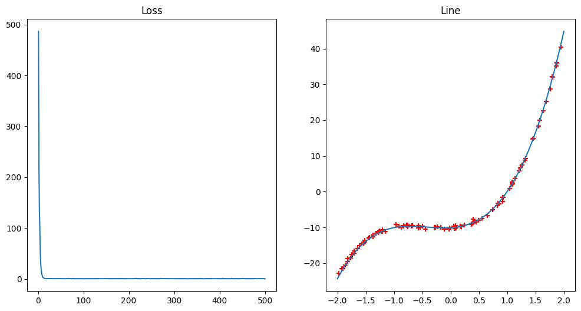

#### 孙哲伟
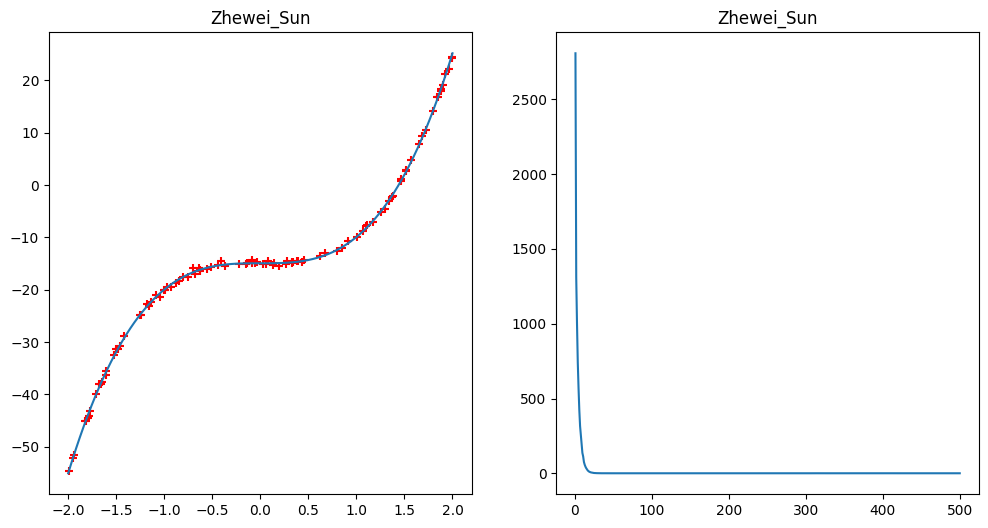

#### 李泽涛
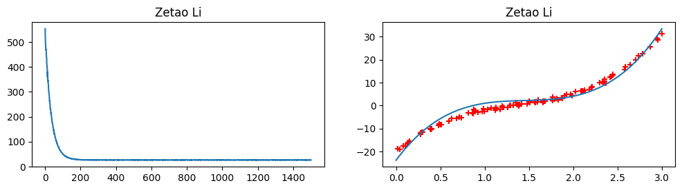

#### 廖军
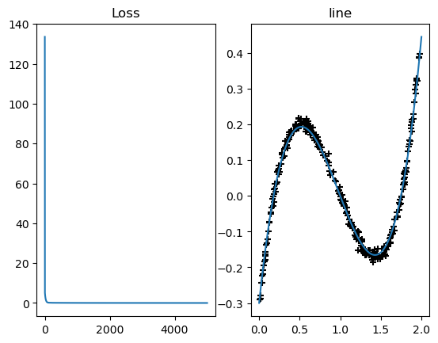

#### 夏星
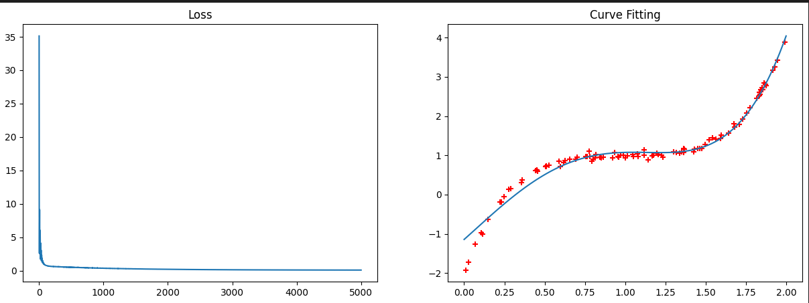

#### 王晓敏
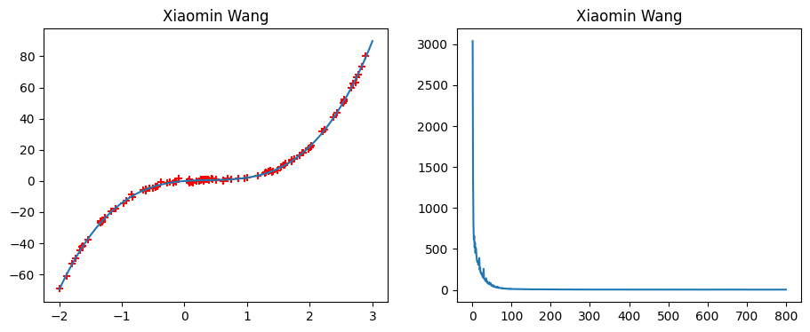

### 第三节 机器学习--MLP,RNN拟合正弦函数

#### 陈靖辉
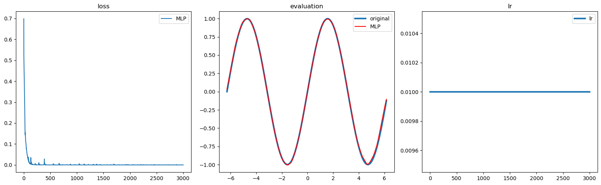
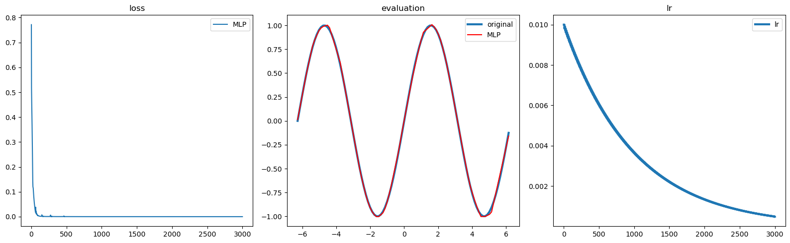

#### 廖军
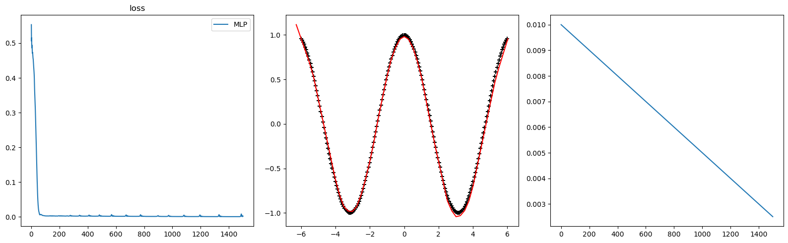

#### 李泽涛

#### 夏星
.png)
.png)

#### 王晓敏
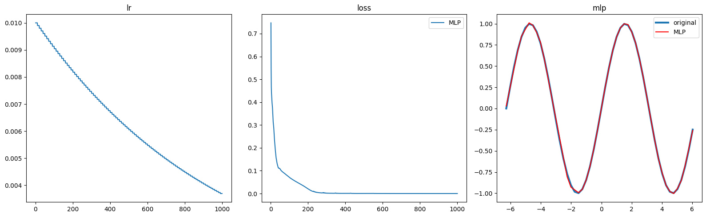

#### 徐安妮
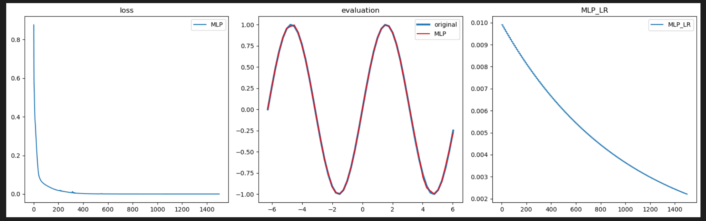

#### 褚皓程
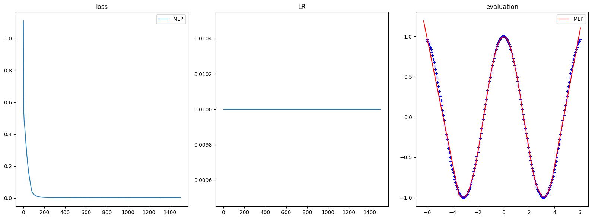
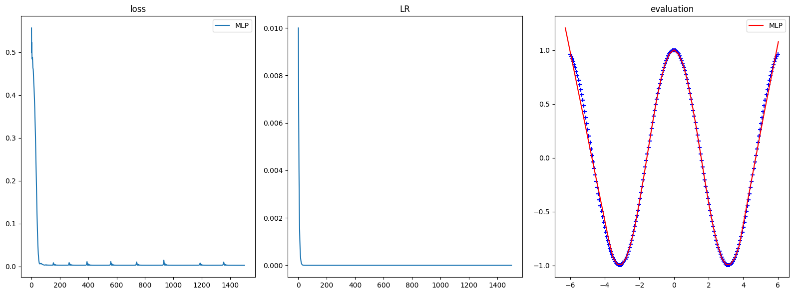

#### 郑凯航

#### 孙哲伟
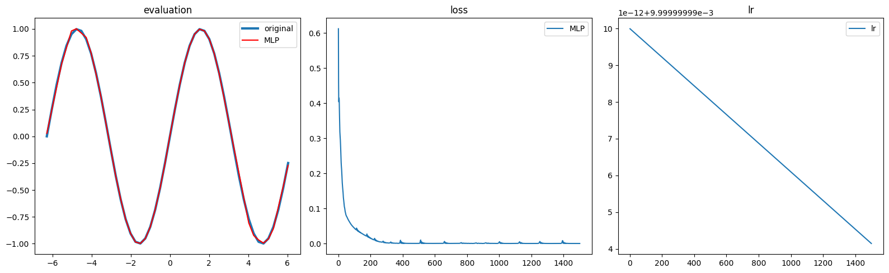

#### 金海洋
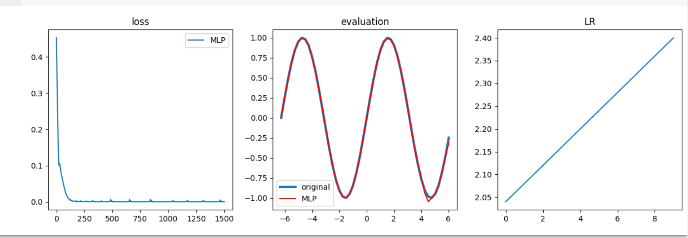

### 第四节 深度学习--MLP实现手写字体识别
 ***必做** 效果图片按训练集准确率，测试集准确率，训练集损失排一排*
 #### 陈靖辉
 

 #### 褚皓程 
 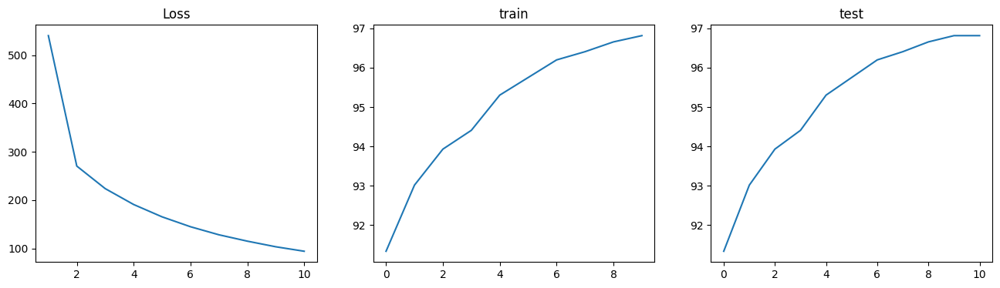

### 第五节 深度学习--CIFAR10分类任务实战
 ***必做** 效果图片按训练集准确率，测试集准确率，训练集损失排一排*
 #### 陈靖辉
 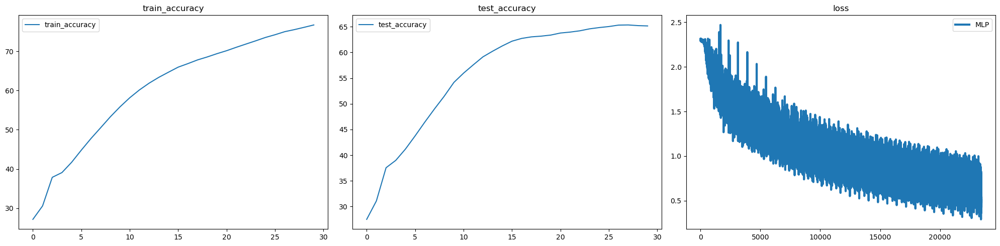
***    
# 你的提交应该在这个上面
## Stargazers over time

